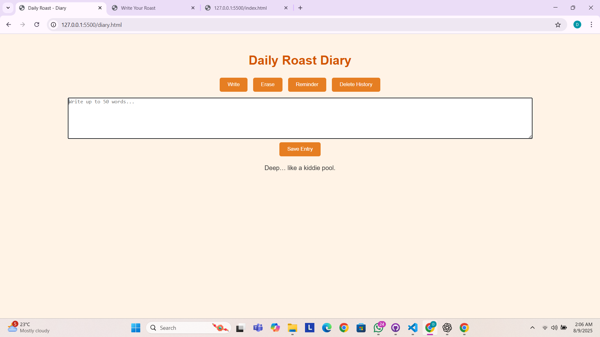

# DAILY ROAST 🎯

## Basic Details
### Team Name: D & D

### Team Members
- Team Lead: DHANIYA OV - GOVERNMENT ENGINEERING COLLEGE IDUKKI
- Member 2: DEVIKA KP - GOVERNMENT ENGINEERING COLLEGE IDUKKI

### Project Description
Daily Roast – One Paragraph Judgy Diary is a fun, browser-based diary app that limits entries to 30 words, roasts your writing, saves history with delete options, and tracks top roasts in a leaderboard.

### The Problem (that doesn't exist)
People have been writing diaries for centuries without receiving any sass back — tragic, right? This solves the “problem” of diaries being too polite by delivering savage roasts, limiting your rambling to 30 words, and turning your emotional outpourings into a competitive sport on the leaderboard.

### The Solution (that nobody asked for)
We built a diary that refuses to be your quiet, supportive friend. Instead, it caps your entries at 30 words, roasts you on the spot, saves the evidence in history, lets you erase disasters instantly, and ranks the most savage burns — because self-improvement is overrated, but self-entertainment is forever.

## Technical Details
### Technologies/Components Used
For Software:
**For Software:**

Languages Used:HTML, CSS, JavaScript
Frameworks Used:Tailwind CSS
Libraries Used:Font Awesome (icons)
Tools Used:Visual Studio Code, Git, GitHub, Browser LocalStorage

For Hardware: none

### Implementation
The application is built using HTML for structure, Tailwind CSS for styling, and JavaScript for interactivity. Font Awesome is integrated for icons, while LocalStorage ensures all diary entries and roasts are stored directly in the browser without requiring a backend server. The app runs seamlessly on any modern web browser, making it lightweight, responsive, and accessible across devices. Development and testing were carried out in **Visual Studio Code, with version control managed via Git and deployment through GitHub.
(https://devika592.github.io/daily-roast-diary/)

# Installation 
Clone the repository: git clone https://github.com/devika592/daily-roast-diary.git

Navigate to the project folder: cd daily-roast-diary

Open the project in VS Code: code .

Run the app:Simply open index.html in your web browser

# Run
Open the project folder:cd daily-roast-diary
Run in browser (directly):Double-click index.html
Run with a local server (optional, for development):npx serve

### Project Documentation
For Software:
# Screenshots (Add at least 3)

cover page

core page

added page

# Diagrams
![Workflow]
The workflow begins when the user opens the Daily Roast Diary and selects the “Write” tab. The user writes an entry, and the system checks the word count limit (30 words). If the limit is exceeded, a roast message is triggered, and the entry is rejected. If the limit is valid, the entry is stored in LocalStorage along with the date and roast generated. The leaderboard updates automatically with the latest roast rankings. Users can switch to the “Erase” tab to clear the current entry, use the “Reminder” tab to set humorous alerts, or visit “History” to review and delete past entries. The app operates entirely on the client side, requiring no internet after initial load.

### Project Demo
#
[video](https://drive.google.com/file/d/1nLYRWSYMk9uvdrcx2MYuSuY3alh7NH32/view?usp=drive_link)

Made with ❤️ at TinkerHub Useless Projects 

